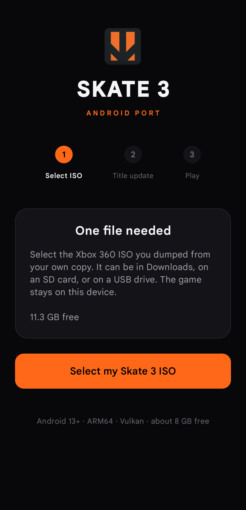
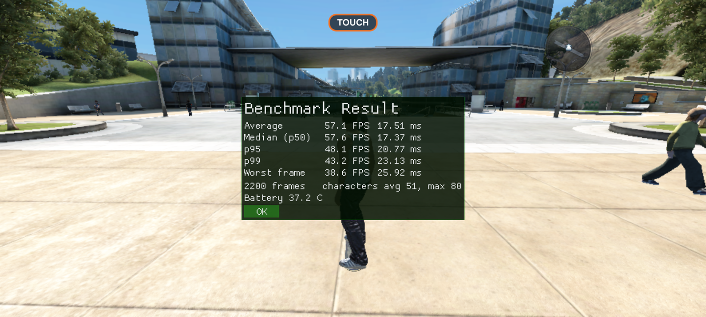

# Skate 3 Port

*Skate 3* running natively on Android phones — not emulated. The Xbox 360 PowerPC code is
statically recompiled ahead of time into native ARM64 and linked against a Vulkan runtime,
so the game runs as real ARM code on your device.

**You need your own copy of the game.** No retail game data is included in this repository
or the APK. The app extracts the files from an ISO you dump yourself, on the phone.

This is experimental software. Expect visual bugs, missing effects, device-specific
problems, and performance that differs between phones.

<p align="center">
  
</p>

---

## Requirements

**Your device**

- Android 13 or newer (API 33+), `arm64-v8a`, Vulkan
- An ARMv8.2 CPU with FP16 and dot-product support
- About **8 GB free** — the extracted install is roughly 6 GB. If the ISO is also on
  internal storage, peak use is around **15 GB** until you delete it afterwards
- A physical controller, or the built-in touch controls

Developed and tested on a **Poco F3** (Snapdragon 870 / Adreno 650).

---

## Getting it running

Download the APK from [Releases](https://github.com/darchap/Skate3-Port/releases), install
it, open it, and the launcher walks you through three steps:

1. **Select My Skate 3 ISO** — pick your ISO with the file picker. The app verifies
   `default.xex` and `data/webkit/EAWebkit.xex` by SHA-256, then extracts them.
2. **Title Update 3** — downloaded and verified automatically. There is a manual file
   picker if that fails.
3. **Play Skate 3** — and you are in.

Repair, start over, and a setup log are there if something goes wrong.

Game files live under `Android/data/io.skate3port.game/files/game/`. **Uninstalling
removes that folder**, so keep your original ISO somewhere safe.

---

## What is different here

This is a fork of *Skate 3 Mobile*, rebuilt around one idea: **the phone should decide how
the game looks, not a preset.**

**Features**

- **Every graphics option is yours.** The Performance / High-End presets are gone and
  nothing re-applies one at boot — the settings file owns every Video row. 3D Scene
  Resolution runs from 512x288 to 1280x720, and the frame cap adds 30, 40, 45 and 50 FPS
  alongside 60 and up. Both apply live, without a restart. 40 divides evenly into 120 Hz
  panels and 45 into 90 Hz, for phones that pace better below their refresh rate.
- **Boot straight into gameplay.** No menus, no front end — the game opens with your own
  profile and save already loaded. "Auto-Boot to Gameplay" in the overlay's System tab
  turns it off.
- **A real benchmark.** Run Benchmark, at the bottom of the Video tab, flies a scripted
  70-second camera path and reports average, median, p95, p99 and worst frame as both FPS
  and milliseconds, with frame and character counts and battery temperature.
- **Percentiles on the FPS counter.** 1% low and p95/p99 frame times over the last four
  seconds, so you can see the stutters an average hides.
- **Ten separate Low-End Devices switches** replace the single `handheld_potato` toggle:
  vegetation, clutter, texture layers, NPC and world update rates (down to every 4th and
  every 8th frame), draw batching, hair, water, and the two spawn switches below. Each is
  its own setting, persisted, defaulting to full quality.
- **Crowds actually stop existing.** Switching off pedestrians and traffic, or movable
  props, stops the LivingWorld spawns at the source — no collision, no voices, no engine
  noise, in career as well as free skate. Not just hidden meshes like in the other build.
  Both apply with Apply & Restart, so the picture and the physics always agree.

- **A launcher worth looking at.** Rebuilt around the three steps that matter: pick
  your ISO, install the title update, play. Progress you can actually read, and it
  gets out of the way once the game is installed.

<p align="center">
  
  <br>
  <sub>Benchmark result on a Poco F3, default settings.</sub>
</p>

**Fixes**

- **It survives being backgrounded.** Lock the screen or switch apps and audio pauses and
  the frame loop parks; come back and the surface is rebuilt, with picture, audio and input
  resuming where they were. A foreground service keeps Android from killing the process
  meanwhile.
- **The game actually quits.** Swiping the app away used to leave it running in the
  background, audio and all, until Android reclaimed the memory. Backgrounding and
  screen lock still keep your session alive as before.
- **The audio crackle is gone.** The rhythmic crackle came from bursty credit dispatch;
  guest audio now follows the hardware's 5.33 ms cadence.
- **MSAA no longer shrinks the scene** into the top-left corner when the scene target is
  smaller than the output — the resolve lands in the scene plane and takes the upscale blit.
- **Shadow rows work without a restart.** The shadow, outline and spline pipelines are
  always built now.
- **The settings overlay stays out of the way.** It no longer opens the pause menu behind
  itself, and closing it no longer reaches the game.

---

## Building from source

Windows 11, native — no WSL or Mac required.

```powershell
.\build-android.ps1              # debug APK -> out\Skate3-Port-debug.apk
.\build-android.ps1 -Install     # ...and adb install it
.\build-android.ps1 -Regenerate  # force codegen again after changing config\*.toml
```

**Toolchain:** CMake 4.4, Ninja, LLVM/Clang 22, MSVC Build Tools 2022 + Windows SDK
(headers only), Python 3.14, JDK 21, Android SDK platform 35 with build-tools 35.0.0 and
NDK 27.2.12479018.

Expect a cold build to take a while — codegen is about 4 minutes cached, and the native
build runs into the tens of minutes on a clean tree. `build-android.sh` is the upstream
macOS/Linux script; it is kept for reference and should not be run on Windows.

---

## Credits

### Alex McHugh

[Alex McHugh](https://github.com/mchughalex) created and maintains
[Skate3Recomp](https://github.com/mchughalex/skate3recomp) and the Skate-specific
[rexglue runtime](https://github.com/mchughalex/rexglue-skate3). His work is the
foundation of this project: the static recompilation pipeline, the native renderer, game
integration, settings, tools, and an enormous amount of reverse engineering. The original
commits and authorship are preserved in this repository.

### Buku313 / Antonio Seevers

This tree is inspired in [Skate 3 Mobile](https://github.com/Buku313/Skate3-Mobile) by
**Buku313**, That fork contributed the Android ARM64
port, SDL Android integration, handheld bring-up and optimisation, and the Android
graphics work this port builds on. Its README credits further contributors to that
lineage.

### Projects used

- [rexglue SDK](https://github.com/rexglue/rexglue-sdk) — BSD-3-Clause, see
  `third_party/rexglue-sdk/LICENSE`
- [Xenia](https://github.com/xenia-project/xenia) — the recompiler and runtime build on
  its work
- [SDL](https://github.com/libsdl-org/SDL)
- [libadrenotools](https://github.com/bylaws/libadrenotools)
- [FFmpeg](https://ffmpeg.org/) — LGPL-2.1-or-later
- [Vulkan](https://www.vulkan.org/)

Full licence texts for everything vendored here are listed in
[docs/THIRD_PARTY_NOTICES.md](docs/THIRD_PARTY_NOTICES.md). This project's own code is
BSD-3-Clause; see [LICENSE](LICENSE).

Thank you to everyone whose Xbox 360 research, testing and open source work made this
possible.

---

## Legal

This is an unofficial fan project. It is not affiliated with Electronic Arts, Black Box,
Microsoft, Google, or the Android project.

*Skate 3*, its characters, names and related assets belong to their respective owners.
Android is a trademark of Google LLC. This repository does not contain the game, the
title update, DLC, generated game code, or any other copyrighted retail data.
